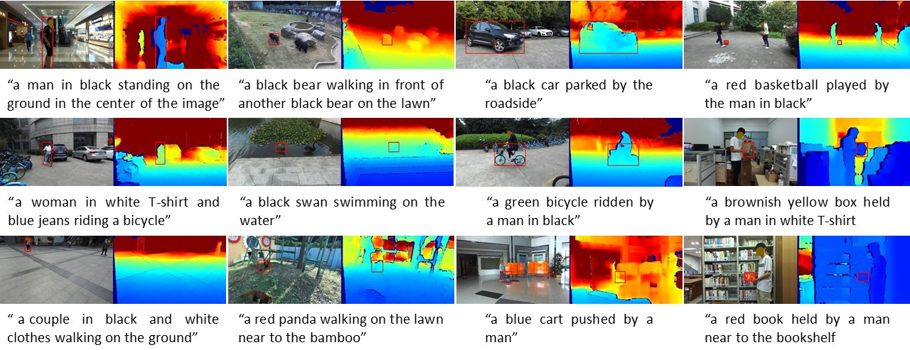

# UniMod1K: Towards a More Universal Large-Scale Dataset and Benchmark for Multi-Modal Learning

The dataset and codes of the paper **UniMod1K: Towards a More Universal Large-Scale Dataset and Benchmark for Multi-Modal Learning**

UniMod1K involves three data modalities: vision, depth, and language.
For the vision and depth modalities, the UniMod1K dataset contains 1,050 RGB-D sequences.
Regarding the language modality, the UniMod1K includes 1,050 sentences describing the target object in each video.
The link of the paper will be released soon. Here are some samples of the dataset:
<center></center>

## Download

The RGB-D images of UniMod1K dataset is available on [Baidu Cloud Disk](https://pan.baidu.com/s/1rcOnztmDjfIGlASVSlJR5Q?pwd=cnln) and [Google Drive](https://drive.google.com/drive/folders/1Z2PnWEgdZG0KVI2MX5chWddNlbuuEug3?usp=share_link). 
Besides, the text files of the UniMod1K can also be downloaded [here](https://drive.google.com/drive/folders/1xUWch1hBMe6ldpiKftumQidlftxsgWoG?usp=drive_link).

## Dataset 
RGB-D sequences and the files of bounding box labels:
```
--UniMod1K
    |--Adapter
        |--adapter1
           |--groundtruth_rect.txt
           |--color
              |--00000001.jpg
              |--00000002.jpg
              ...
           |--depth
              |--00000001.png
              |--00000002.png
              ...           
        |--adapter2
        ...
    |--Animal
       |--alpaca1
           |--groundtruth_rect.txt
           |--color
              |--00000001.jpg
              |--00000002.jpg
              ...
           |--depth
              |--00000001.png
              |--00000002.png
              ...            
       |--bear1
        ...
    ... 
```
The natural language files:
```
--UniMod1K
    |--Adapter
        |--adapter1
           |--nlp.txt
        |--adapter2
           |--nlp.txt
        ...
    |--Animal
       |--alpaca1
           |--nlp.txt           
       |--bear1
           |--nlp.txt        
        ...
    ... 
```

## Dataset Format
The RGB images are saved in the 24-bit JPEG format with 8 bits allocated to each channel, whereas the depth maps are saved in the 16-bit PNG format.
For the labels, the format of rectangle bounding boxes is as [x1, y1, w, h]. (x1, y1) is the top-left corner of targeted object, while the w and h are the width and height of the target bounding box.

## Data Visualisation
After downloading the data and corresponding label files, you can visualise the samples by:
```
cd /path/to/UniMod1K
export PYTHONPATH=/path/to/SPT:$PYTHONPATH
python ./read_dataset.py --data_dir '/path/to/UniMod1K/' --nlp_dir '/path/to/nlps/' --seq_id 0
```

## Baselines Codes and pre-trained models
For the usages of the baselines and the UniMod1K, please refer to the [README_SPT](./SPT/README.md). The training and test codes of the SPT, as well as the trained model are provided.

## Contact
If you have any question, please feel free to [contact us](xuefeng_zhu95@163.com)(xuefeng_zhu95@163.com)